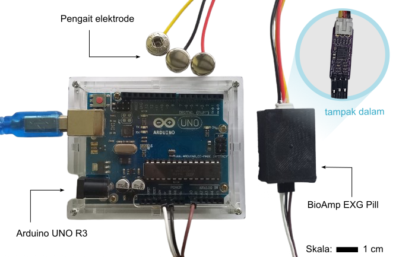
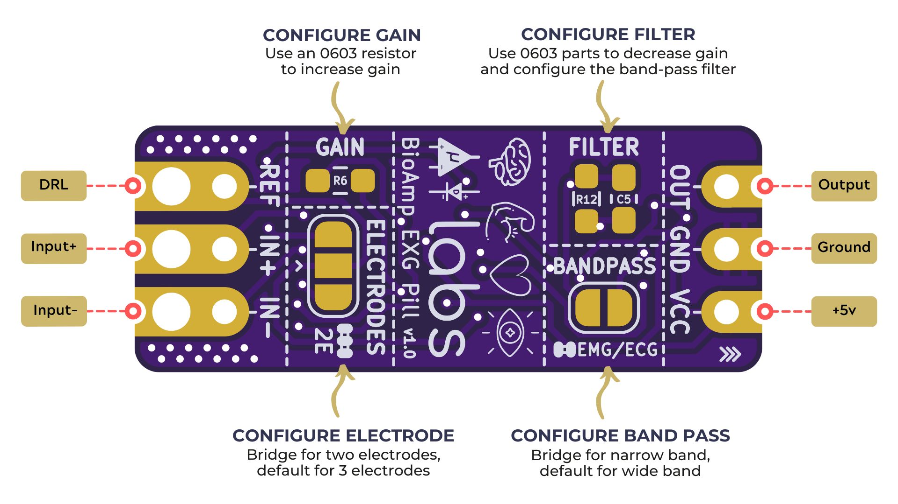
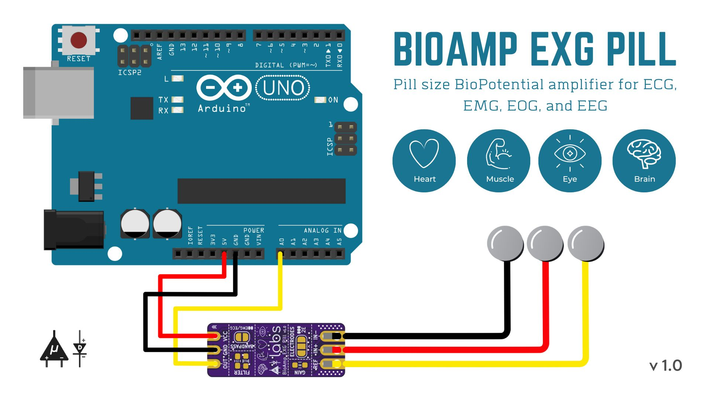
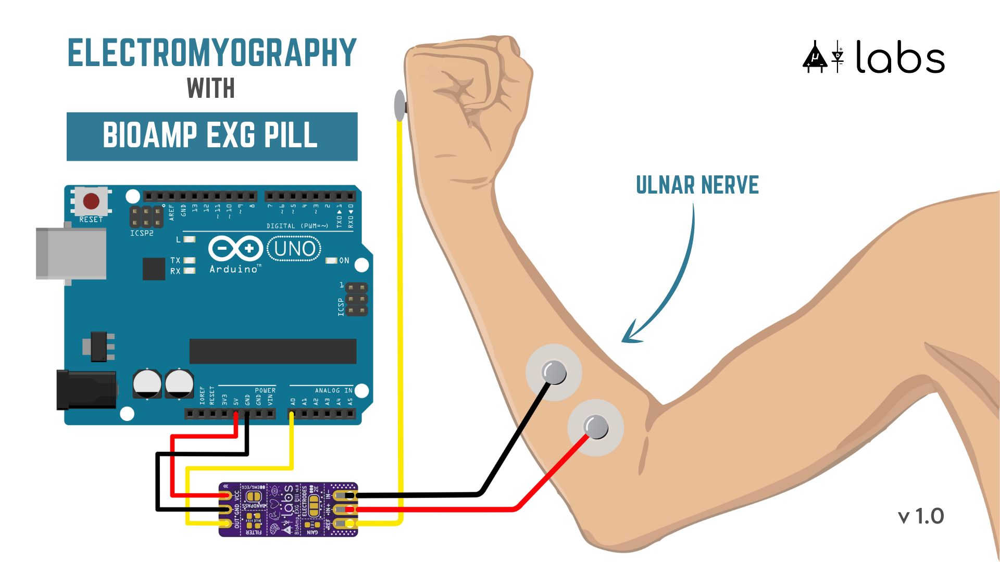
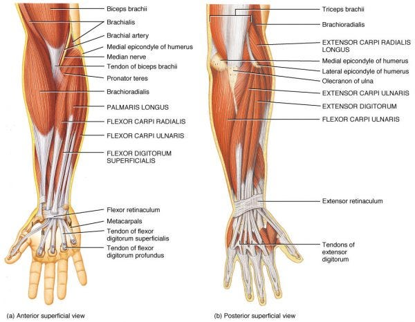

# Panduan Penggunaan BioAmp EXG Pill

## Pendahuluan

BioAmp EXG Pill merupakan bioamplifier buatan Upside Down Labs dari India yang dapat digunakan untuk sinyal biopotensial seperti EEG, EKG, EMG, dan EOG. Dengan daya dan *noise* yang rendah serta ukurannya yang kecil, bioamplifier ini dapat dengan mudah diintegrasikan ke dalam berbagai sistem melalui unit mikrokontroler 5 V (contoh: Arduino Uno) yang dilengkapi dengan *analog-to-digital converter* (ADC). Karena bioamplifier ini bersifat *open-source*, publik dapat dengan bebas mengakses informasi seperti skematik rangkaian dan contoh kode program dari perangkat ini melalui [GitHub](https://github.com/upsidedownlabs/BioAmp-EXG-Pill) dan [*website*](https://docs.upsidedownlabs.tech/hardware/bioamp/bioamp-exg-pill/index.html) mereka.

## Konfigurasi

Bioamplifier ini memiliki total 6 pin yang terbagi menjadi 2 kelompok:
- Kelompok pin pertama (kiri pada gambar) terdiri dari 3 pin pada konektor JST yang terhubung ke kancing elektroda.
	- `REF` atau DRL (*driven right leg*), dihubungkan ke pin *reference* pada elektroda.
	- `IN+` atau Input+, dihubungkan ke pin positif elektroda.
	- `IN-` atau Input-, dihubungkan ke pin negatif elektroda.
- Kelompok pin kedua (kanan pada gambar) terdiri dari 3 pin *male* yang terhubung ke mikrokontroler.
	- `OUT` atau Output, merupakan pin yang menghasilkan sinyal analog dari pengukuran sinyal biopotensial dengan rentang nilai 0-5 V.
	- `GND` atau Ground, pin yang dihubungkan ke pin GND pada mikrokontroler.
	- `VCC` atau +5V, pin yang dihubungkan ke sumber tegangan 5 V yang tersedia pada mikrokontroler atau sumber eksternal.

> [!WARNING]
> Jika bioamplifier ini ingin digunakan pada mikrokontroler dengan level tegangan 3.3 V, sinyal analog pada pin `OUT` bioamplifier perlu diturunkan ke level tegangan 3.3 V dengan menggunakan rangkaian pembagi tegangan.

Terdapat juga beberapa *pad* pada bioamplifier yang dapat di-*short* atau ditambah dengan komponen lain untuk mengatur parameter seperti konfigurasi pengukuran (unipolar atau bipolar), besaran *gain*, dan karakteristik filter. Untuk kepraktisan penggunaan, fitur ini untuk sementara tidak digunakan. Jika parameter-parameter tersebut ingin diubah, pengubahan nilai parameter dapat dilakukan dengan menggunakan program.

## Prosedur Penggunaan dengan Arduino

1. Sambungkan bioamplifier dengan kabel elektroda melalui konektor JST yang tersedia.

	| BioAmp EXG Pill | Elektroda |
	| --- | --- |
	| REF | Referensi (kuning) |
	| IN+ | Positif (merah) |
	| IN- | Negatif (hitam) |

2. Sambungkan bioamplifier dengan papan Arduino menggunakan kabel *jumper*.

	| BioAmp EXG Pill | Arduino |
	| --- | --- |
	| VCC | 5V |
	| GND | GND |
	| OUT | A0 |

>[!WARNING]
> Pastikan pemasangan pin VCC dan GND tidak tertukar. Pemasangan kabel *jumper* yang tertukar pada kedua pin tersebut dapat merusak bioamplifier.

3. *Upload* program ke Arduino menggunakan Arduino IDE.
4. Nyalakan Arduino dan buka *serial plotter* di Arduino IDE.

> [!TIP]
> Untuk mengetes apakah ketiga elektroda sudah siap digunakan untuk mengukur sinyal EMG, sentuhkan ketiga kepala elektroda. Elektroda telah siap digunakan jika sinyal yang muncul pada *serial plotter* menjadi datar (atau relatif datar) ketika ketiga kepala elektroda saling bersentuhan.

5. Hubungkan ketiga kabel elektroda dengan elektroda Ag/AgCl.
6. Bersihkan permukaan kulit yang akan ditempeli elektroda dengan menggunakan alkohol dan biarkan hingga kering. Hal ini dilakukan untuk membersihkan kulit dari kotoran, sel kulit mati, dan keringat.

7. Tempelkan ketiga elektroda ke permukaan kulit yang dekat dengan otot yang ingin diamati. Elektroda positif dan negatif perlu ditempelkan berdekatan satu sama lain pada bagian otot yang aktif ketika subjek melakukan gerakan yang ingin diukur, sedangkan elektroda referensi ditempelkan pada otot yang tidak aktif pada gerakan tersebut. 

>[!NOTE]
> Untuk mengukur kekuatan menggenggam, elektroda positif dan negatif dapat ditempelkan pada permukaan kulit yang dekat dengan otot flexor carpi ulnaris. Elektroda referensi dapat ditempelkan pada tulang siku (direkomendasikan) atau punggung tangan.
> 
> 
> 
> (Sumber gambar: [link](https://medium.com/performance-course/the-importance-of-a-strong-grip-91a592323349))

## FAQ dan Troubleshooting

### Serial plotter Arduino IDE ter-update terlalu cepat

Permasalahan ini umum dikeluhkan pada Arduino IDE versi 2.x karena serial plotter pada versi ini hanya menampilkan 50 data dalam satu frame. Solusi ringkas dari permasalahan ini adalah dengan memakai Arduino IDE versi 1.x karena *serial plotter* pada versi ini dapat menampilkan 500 data dalam satu *frame*.

Jika ingin tetap menggunakan Arduino IDE versi 2.x, solusi yang bisa dilakukan adalah dengan mengganti nilai yang ada pada *source code* dari *serial plotter* Arduino IDE. *Source code* tersebut dapat diakses pada *file* `main.35ae02cb.chunk.js` yang terdapat di dalam folder instalasi Arduino IDE `\Arduino IDE\resources\app\lib\backend\resources\arduino-serial-plotter-webapp\static\js`. 

Di dalam *file* `main.35ae02cb.chunk.js`, cari kata kunci berikut: `U=Object(o.useState)(50)`. Angka `50` pada kata kunci tersebut merepresentasikan jumlah data yang ditampilkan dalam satu *frame* *serial plotter*. Ganti nilai `50` dengan jumlah data yang diinginkan, misal `5000`. Setelah diubah, simpan perubahannya dan tutup *file* tersebut. 

### Sinyal yang muncul pada serial plotter tidak sesuai dengan gerakan yang dilakukan

Kejadian ini dapat disebabkan oleh beberapa faktor, di antaranya adalah posisi elektroda yang tidak sesuai atau *noise* yang terlalu besar sehingga menutupi sinyal yang terukur. Berikut adalah beberapa hal yang dapat dilakukan sebagai solusi.

- Pastikan bahwa jumper/kabel yang terhubung pada bioamplifier telah terpasang dengan baik. Kabel yang kendur dapat memunculkan *noise* dan/atau mengganggu proses pengiriman data. 
- Pastikan otot yang berada dekat dengan elektroda merupakan otot yang aktif pada gerakan tersebut. Selain itu, pastikan juga bahwa elektroda referensi berada pada bagian tulang atau otot yang tidak aktif ketika gerakan tadi dilakukan. 
- Pastikan bahwa semua elektroda telah menempel dengan erat pada permukaan kulit. Elektroda yang tidak melekat dengan baik pada permukaan kulit dapat memunculkan *noise* yang relatif besar karena adanya rongga udara di antara elektroda dan pemukaan kulit.
- Jauhkan kabel dari perangkat elektronik dengan daya besar atau daerah dengan interferensi elektromagnetik tinggi. Medan magnet dari kabel di sekitar elektroda dapat menyusup masuk ke dalam sinyal yang terukur oleh bioamplifier.
- Jika mikrokontroler terhubung ke laptop yang sedang melakukan pengisian daya, lepas kabel pengisian daya laptop selama pengukuran. Laptop yang terhubung ke jala-jala listrik akan memberikan *noise* 50 Hz yang relatif tinggi ke sinyal yang terukur.
- Kabel yang berayun dapat memunculkan sinyal *spike* pada sinyal hasil pengukuran. Hal ini bisa dihindari dengan dengan merekatkan kabel ke benda lain yang relatif statis (misal meja). Pastikan juga kabel tidak banyak terayun selama subjek melakukan gerakan.
- Gunakan filter *notch* digital/analog yang dapat menghilangkan *noise*. *Noise* yang muncul umumnya berada pada frekuensi 50 Hz. Untuk memastikan karakteristik dari *noise*, lakukan pengukuran singkat dan olah data hasil pengukuran tersebut dengan algoritma *fast fourier transform* (FFT) untuk mendapatkan informasi sinyal pada domain frekuensi.

### Elektroda mudah lepas ketika melakukan pengukuran gerakan

Elektroda yang mudah lepas dapat disebabkan oleh fungsi perekat yang kurang kuat. Di samping itu, sifat perekat elektroda konvensional yang cenderung kaku juga dapat menyebabkan delaminasi pada elektroda untuk gerakan-gerakan tertentu, terlebih ketika elektroda diletakkan pada permukaan kulit yang mengalami proses kontraksi dan peregangan selama subjek melakukan gerakan.

Solusi dari permasalahan ini adalah dengan menggunakan perekat tambahan seperti plester luka atau *micropore* untuk membantu merekatkan elektroda pada permukaan kulit karena kedua plester tersebut memiliki sifat yang cukup elastis.

### 